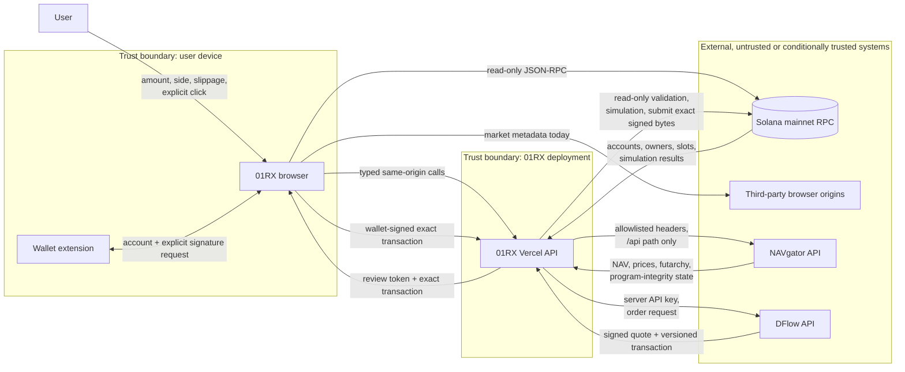

# 01RX Launch-Readiness Audit

| Field | Value |
|---|---|
| Audit date | 2026-07-30 EDT / 2026-07-31 UTC |
| Audited commit | `6d56362dcb58b1a91bf627025d5c59e7cf752cfa` |
| Audited tree | `e663ccc8bd7b0a3c0d13f0d6a1970c0fb9435e39` |
| Target baseline | `origin/main` at `c4f3c50ec8045b31b35f29e68a419ddb89f123e1` |
| Tree parity | Audited tree and target-baseline tree are identical |
| Scope | All tracked 01RX code; NAVgator is an external integration |
| Production activity | GET/HEAD and read-only public RPC only |
| Runtime changes | Audit run: none; post-audit H-01 remediation and release verification: 2026-07-31 |
| Overall status | **NOT AUDIT-READY** |

## Executive conclusion

01RX has several unusually good execution controls already: code-owned ownership
mint allowlists, strict request schemas, authenticated DFlow responses,
top-level program allowlisting, lookup-table verification, mainnet simulation,
short-lived review tokens, exact transaction fingerprints, explicit wallet
approval, co-signature preservation, and fail-closed program-integrity checks
for decision-market trading.

The audit recorded five High findings. Post-audit remediation on 2026-07-31
implemented the H-01 code-owned DFlow instruction, program, account, and
simulated-effect policy. A sanitized authentic unsponsored production `/order`
then passed that policy without signing or broadcasting, closing H-01. Four
other High findings remain:

1. API-provided launchpad metadata reaches `innerHTML` without escaping, creating
   a DOM-injection path on a wallet-enabled trading origin.
2. Mutable third-party scripts execute on the trading origin without a CSP or
   integrity boundary.
3. Trading abuse controls are stored in one serverless instance and do not
   provide a distributed rate limit.
4. Six inherited High dependency paths remain open without a named,
   time-bounded risk acceptance.

The repository therefore does not meet the stated gate of “no unaccepted
Critical or High finding.” No Critical finding was identified. The audit
recorded 5 High, 9 Medium, and 2 Low findings; the current ledger has 4 open
High findings. No High is accepted.

The original audit changed documentation and gitignored evidence only.
Post-audit runtime changes follow the ordered remediation plan below.

## Scope, method, and limitations

The review covered 156 tracked files and 104,520 tracked lines. It combined:

- manual source review of all serverless entrypoints, execution services,
  wallet adapters, browser entrypoints, API clients, and deployment policy;
- 426 native Node tests with instrumented coverage;
- npm dependency, registry-signature, installed-tree, SBOM, outdated-package,
  and license queries;
- a checksum-verified Gitleaks 8.30.1 full-history scan;
- bounded ESLint dangerous-syntax, duplication, and dead-code experiments;
- a production Vite build and bundle inventory;
- GET/HEAD-only production DNS, redirect, header, cache, and API probes; and
- read-only Solana mainnet account/program checks using public JSON-RPC.

The DFlow review was traced against the
[DFlow request-sign-submit flow](https://pond.dflow.net/spot/recipes/quickstart).
Account validation was assessed against
[Solana's address-verification guidance](https://solana.com/docs/payments/send-payments/verify-address).
The rate-limit recommendation follows
[Vercel WAF rate-limiting guidance](https://vercel.com/docs/vercel-firewall/vercel-waf/rate-limiting).

Limitations:

- NAVgator source, DFlow internals, wallet-extension internals, Vercel control
  plane configuration, Supabase RLS/project configuration, and private
  TradingView assets were not available for source review.
- Production secrets were neither read nor used.
- No order was requested, and no user transaction was generated, simulated,
  signed, or submitted during production checks.
- Static analysis is not yet a repository capability. The bounded scan did not
  substitute for a configured Semgrep/CodeQL-style CI gate.
- Native coverage cannot reliably instrument the classic-script legacy token
  page, so the reported aggregate is not coverage of all shipped JavaScript.
- Public RPC state is a point-in-time, untrusted observation, not a permanent
  attestation.

Local machine evidence is stored in `.context/audit/` and is intentionally
gitignored. It contains reproducible commands and redacted summaries, not
private environment data.

## Architecture and trust boundaries



### Input inventory

“Trusted” means code-owned or deployment-owned, not infallible. Every network,
wallet, browser-location, and chain response remains untrusted until validated.

| Input | Classification | Consumer | Current validation | Gap |
|---|---|---|---|---|
| Browser amount, side, outcome, slippage | Untrusted | Controller and trading API | Decimal/u64 bounds, enum checks, unknown-field rejection | Property-based boundary coverage is incomplete |
| Browser URL path/query/hash | Untrusted | Boot/router/auth return | URL parsing, selected allowlists, encoded outbound components | Dormant auth auto-loads on hash markers; inline handlers complicate CSP |
| Wallet address/account | Untrusted | Solana trading | Base58/PublicKey parse, mainnet account selection, fee-payer equality | Legacy provider capabilities are less uniform |
| Wallet-returned signed bytes | Untrusted | Browser and trading API | Exact message comparison when `signTransaction` is available; signature verification server-side for DFlow submission | `signAndSendTransaction` cannot return bytes for independent comparison |
| NAVgator market/token data | Untrusted network data | Browser/relay/trading registry | JSON shapes in typed client; code-owned ownership allowlist; status filters | Legacy presentation fields are not uniformly escaped |
| NAVgator program-integrity data | Untrusted attestation | Decision controller | Shape, count, status, and base58 checks | Browser does not compare IDs/slots/authorities with a code-owned inventory |
| DFlow response | Untrusted vendor response | DFlow service | Status/type/size, Ed25519 proof, digest, request ID, timestamp, pinned public key | Transaction instruction semantics are only partially bound |
| DFlow API key | Server secret | DFlow service | Required in production/preview; never returned | Operational rotation and Vercel scope were not inspectable |
| `NAVGATOR_API_ORIGIN` and RPC URL | Trusted deployment configuration | Relay/services | HTTPS origin validation for NAVgator; Connection construction for RPC | Missing NAVgator env falls back to a future product domain |
| Solana account/RPC response | Untrusted chain observation | Browser/services | Owner, discriminator, PDA, mint, token-account, executable, slot, and simulation checks depending on flow | Program inventory is incomplete; availability can fail closed |
| Code constants and generated metadata | Trusted build inputs | Browser/services | Git review and build | No CODEOWNERS/CI enforcement protects critical changes |
| Third-party scripts and assets | Untrusted supply chain | Browser | HTTPS and some fixed asset versions | Scripts lack SRI/CSP/self-hosting; one CDN uses a mutable major version |
| Supabase browser anon token | Public capability, not a secret | Dormant auth/watchlist | Supabase RLS would be the security boundary | Project/RLS unavailable; dormant client remains shipped |

## Threat model

### Protected assets

- user funds and exact wallet-approved transaction intent;
- DFlow and RPC credentials, quotas, and availability;
- code-owned mint/program allowlists and review-token signing material;
- correctness and freshness of NAV, price, and decision-market state;
- production domain and deployment integrity;
- user trust in the trade ticket, simulation, and confirmation state.

### Relevant actors and failure modes

- a malicious browser user sending malformed, oversized, replayed, or
  high-volume API requests;
- a compromised or buggy NAVgator, DFlow, RPC, CDN, analytics, or wallet
  dependency;
- stale or mismatched Vercel deployment/environment configuration;
- an upstream Solana program upgrade after code review;
- malicious token metadata or URL content reaching a browser sink;
- a dependency or contributor introducing unsafe code without automated review;
- an honest user approving a transaction whose displayed economics differ from
  its encoded instruction.

### Security invariants

1. 01RX never signs or submits without an explicit user wallet action.
2. The exact message simulated and reviewed must be the message approved.
3. A vendor signature authenticates a response but does not replace semantic
   transaction validation.
4. Programs, mints, accounts, owners, PDAs, signers, writable privileges,
   amounts, and recipient accounts must be allowlisted or derived from reviewed
   intent.
5. Private execution responses are never shared-cacheable.
6. Browser code never receives server secrets or constructs DFlow execution
   URLs.
7. A failed integrity or availability check pauses execution rather than
   silently downgrading validation.

## API path review

Tracked serverless paths:

- `/api/:path*` and `/api/relay` — same-origin NAVgator relay;
- `/api/beta/futarchy` and `/api/v1/futarchy` — relay entrypoint aliases; and
- `/api/beta/trading?view=decision-attest|spot-order|spot-submit` — local guarded
  execution.

| Control | NAVgator relay | Trading endpoint |
|---|---|---|
| Methods | GET, HEAD, POST, OPTIONS; rejects others | POST, OPTIONS; rejects others |
| Query validation | Requires `/api/` path; otherwise forwards query | Only `view`; rejects unknown keys and unknown operations |
| Body validation | 2 MiB request bound; body is opaque to relay | 128 KiB; JSON object; service-specific strict schemas |
| SSRF | Server origin must be an HTTPS origin with no credentials/path/query/fragment | DFlow URL selected from code-owned allowlist; registry origin has same HTTPS restrictions |
| Request headers | Only `Accept` and `Content-Type`; replaces User-Agent | Does not forward browser auth/cookies to DFlow |
| Redirects | `redirect: manual` | DFlow `redirect: manual` |
| Timeout | 25 seconds | DFlow 12 seconds; registry 5 seconds; RPC calls depend on client/provider |
| Response limit | **Missing for general relay** | 64 KiB DFlow; 128 KiB registry; 1,232-byte transaction |
| Replay | Read relay has normal cache/retry semantics; POST is opaque | Review token is short-lived and exact-message bound; duplicate Solana bytes retain one signature |
| Cache | Upstream cache header is forwarded, overriding one uniform policy | `private, no-store` |
| Error disclosure | Generic relay error | Expected 4xx messages; redacted bounded 5xx diagnostics |
| Log redaction | No request logging in handler | API-key query and query-bearing URL redaction; 500-char limits |
| IP source | Not used | Trusts Vercel-forwarded/real-IP headers at application layer |
| Abuse control | Platform defaults only | Per-instance `Map`; not distributed |

Positive conclusions:

- No user-controlled outbound origin was found, so no direct SSRF path was
  identified.
- Browser cookies and authorization headers are stripped by the relay.
- Redirect following is disabled.
- Trading query/body schemas reject unknown fields, which reduces ambiguous
  contract behavior.
- Private execution responses are marked `private, no-store`.

Open concerns are recorded as H-04, M-02, and M-06.

## Execution-flow assessment

### Ownership trade through DFlow

| Required control | Result | Evidence |
|---|---|---|
| Code-owned tradable token set | Pass | 17 ownership mints and USDC are pinned in `ownership-token-registry.js`; NAVgator can disable but cannot add a mint |
| Request shape/amount/slippage | Pass | Strict fields, canonical addresses, u64 atomic amount, and 1–500 bps slippage |
| Production secret boundary | Pass | Production/preview fail closed without server `DFLOW_API_KEY`; browser receives no key |
| Vendor response authenticity | Pass | Pinned Ed25519 public key, body digest, request ID, timestamp, and signed headers |
| Status/type/size bounds | Pass | JSON status/type checks; 64 KiB response and 1,232-byte transaction bounds |
| Allowed top-level programs | Partial | Exactly one DFlow instruction; other top-level instructions may only be Compute Budget |
| Lookup tables | Pass | On-chain lookup accounts are loaded and compared with vendor proofs |
| Fee payer/signers | Pass | Exactly one unsigned signer and it must equal the connected owner |
| Mint/account presence | Partial | Owner/input/output mints must be in the message and DFlow instruction accounts |
| Account owner/role/writable policy | **Fail** | DFlow account metas are not fully classified against expected roles |
| Atomic input/minimum output | **Fail** | DFlow instruction bytes are not decoded and compared with quote intent |
| Slippage and route/market | **Fail** | Route `marketKey` is validated as a quote field but not required in the instruction account set |
| Compute-budget caps | **Fail** | Compute Budget is allowlisted, but instruction tags/limits/prices are not decoded |
| Mint decimals | Partial | Output decimals are accepted from the authenticated vendor response rather than independently read from the mint |
| Exact-message binding | Pass | Review token binds vendor proof; browser/server compare the reviewed message; transaction fingerprint is returned |
| Simulation | Pass | Exact v0 transaction is simulated at/after quote context slot; final signed bytes are simulated with signature verification |
| Expiry | Pass | Quote timestamp, review age, blockhash, and last-valid block height are enforced |
| Wallet approval | Pass | The user must approve in the wallet; no automatic signing |
| Signature preservation | Pass | Wallet-returned message must match; wallet signature is verified; no co-signature stripping |
| Submission | Pass | Exact signed bytes, preflight enabled, bounded retries, no automatic rebuild |
| Program-upgrade monitoring | **Fail** | DFlow is not included in the current production program-integrity response |

The central distinction is authentication versus authorization: the Ed25519
proof authenticates DFlow's response, but the missing instruction decoder means
01RX has not independently authorized the complete economics encoded by that
response.

### Decision-market trade

The decision flow is stronger at the instruction level:

- the browser derives and validates proposal, DAO, vault, conditional-mint,
  token-account, Manifest market, and PDA relationships;
- account owners and discriminators are checked before construction;
- the attribution service accepts only one vault split and one MetaDAO swap,
  decodes outcome/side/atomic amounts, limits top-level programs, requires the
  trader as fee payer, and gives the attribution authority only a memo
  co-signature role;
- the browser verifies the returned original and memo instructions exactly;
- the built transaction is simulated, fingerprinted, and expires after a short
  review window; and
- `sendPlan` verifies the reviewed fingerprint and wallet-returned bytes before
  RPC submission when the wallet supports `signTransaction`.

Residual gaps are the upstream-trusted program-integrity inventory (M-01), the
wallet-standard sign-and-send fallback (L-01), and incomplete negative/property
coverage (M-05). Recurring orders were disabled and had no configured program ID
at audit time; they must remain disabled until M-01 is fixed.

## Read-only mainnet verification

At slots approximately `436283879`–`436283951`, public RPC returned:

- DFlow, MetaDAO Futarchy, Conditional Vault, Manifest Core, Manifest Wrapper,
  Memo, Compute Budget, SPL Token, and Associated Token as existing executable
  programs;
- independently derived upgradeable ProgramData records for all five
  application programs;
- all 17 code-allowlisted ownership mints plus USDC as existing,
  non-executable, classic SPL Token-owned accounts; and
- a recent DFlow deployment slot (`436232368`) relative to the sampled chain
  slot.

The production program-integrity endpoint reported Futarchy, Conditional Vault,
Manifest Core, and Manifest Wrapper as verified against expected slots and
authorities. It did not report DFlow. These checks validate account structure at
one point in time; they do not make RPC or upstream attestations trusted.

## Test, dependency, secret, and build baseline

### Tests and coverage

All 426 tests passed. Instrumented coverage was 68.58% line, 64.47% branch, and
80.00% function. Critical modules were below the planned gate:

| Module | Line | Branch |
|---|---:|---:|
| DFlow spot service | 67.31% | 50.28% |
| Decision attribution | 68.03% | 55.93% |
| Trading route | 79.72% | 54.05% |
| Solana trading | 64.91% | 45.92% |
| Decision controller | 79.74% | 66.20% |

The 24,502-line legacy page is not reliably included in native coverage.

### Dependencies and licenses

- `npm audit` reported 0 Critical and 6 High paths, all inherited from
  `bigint-buffer` advisory `GHSA-3gc7-fjrx-p6mg`.
- Registry metadata exposed 331 verified signatures and 30 attestations.
- `npm ls --all` and `npm sbom` failed because the workstation install contained
  invalid/extraneous relationships. Release evidence must come from clean
  `npm ci`.
- Review-required licenses include LGPL-3.0-only `rpc-websockets`, BSL-1.0
  `@metadaoproject/programs`, and two transitive packages with no declared
  license. The workspace packages are intentionally proprietary/undeclared;
  choosing a public license is outside this audit.
- The build passed, but Vite warned about the 1.09 MB token-page and 989 kB
  Solana-trading chunks before gzip.

### Secret history and static analysis

The checksum-verified full-history Gitleaks scan reported 1,556 repeated matches.
They collapsed to a public DFlow verification key, a public Supabase anon JWT,
and test fixtures. No high-confidence private credential was identified.

That is not a clean security outcome for the Supabase code: the anon token is
not supposed to be secret, but the dormant remote auth client and unknown RLS
state still expand the production attack surface.

A bounded ESLint dangerous-syntax pass found no `eval`, `new Function`,
implied-eval, or `with`. Duplication and dead-code tools require repository
configuration before their results are enforceable; the legacy global-script
architecture caused material false positives and made an unbounded duplication
scan impractical.

## Production and deployment observations

Read-only checks found:

- `https://01rx.vercel.app/` served the audited 01RX product;
- `https://navgator.xyz/` still served the old NAVgator product;
- `api.navgator.xyz` did not resolve;
- current preview deployments lagged the production commit;
- the production futarchy API advertised contract release `2026-07-25` while
  the audited contracts advertise `2026-07-30`; and
- the same response advertised
  `futarchy-historic-markets-db-unavailable` and
  `futarchy-proposal-config-mismatch`.

The production roots had HSTS but no explicit CSP, frame, MIME-sniffing,
referrer, permissions, opener, or embedder policy. Root responses also exposed
`Access-Control-Allow-Origin: *`.

The repository's cutover document expects `navgator.xyz` to serve 01RX and
`api.navgator.xyz` to serve NAVgator. Production did not match that documented
state.

## Findings register

All findings are Open unless explicitly accepted. No High is accepted.
“Owner” names an accountable role; a person must be assigned before work begins.

| ID | Severity | Finding | Component | Owner | Status | Acceptance expiry |
|---|---|---|---|---|---|---|
| H-01 | High | DFlow transaction semantics are not fully bound to reviewed intent | Execution backend | Execution security owner | Closed 2026-07-31 | N/A |
| H-02 | High | Unescaped API metadata reaches a DOM HTML sink | Legacy browser UI | Frontend security owner | Open | N/A |
| H-03 | High | Mutable third-party scripts execute on the trading origin | Browser/deployment | Frontend/platform owner | Open | N/A |
| H-04 | High | Per-instance rate limiting is ineffective as a serverless abuse boundary | Trading API | Platform owner | Open | N/A |
| H-05 | High | Six inherited dependency findings have no formal expiring exception | Supply chain | Dependency owner | Open | N/A |
| M-01 | Medium | Program-integrity policy is upstream-defined and incomplete | Decision/recurring/DFlow | Execution security owner | Open | N/A |
| M-02 | Medium | Relay has an unbounded response and overly broad path/cache policy | API relay | API owner | Open | N/A |
| M-03 | Medium | Installed dependency tree is invalid and blocks an SBOM | Supply chain | Dependency owner | Open | N/A |
| M-04 | Medium | Shipped third-party license obligations are unresolved | Supply chain/legal | Dependency owner | Open | N/A |
| M-05 | Medium | Critical execution coverage is below the release gate | Tests | Test owner | Open | N/A |
| M-06 | Medium | Production domain, contract, degraded-state, and preview parity drift | Deployment | Release owner | Open | N/A |
| M-07 | Medium | Browser security-header baseline is absent | Browser/deployment | Platform owner | Open | N/A |
| M-08 | Medium | CI, lint/type checks, ownership, and security governance are absent | Repository | Engineering owner | Open | N/A |
| M-09 | Medium | Monoliths and direct/global browser boundaries make safety review fragile | Browser architecture | Frontend owner | Open | N/A |
| L-01 | Low | Sign-and-send wallet fallback cannot independently inspect returned bytes | Wallet integration | Wallet owner | Open | N/A |
| L-02 | Low | Silent catches and limited structured telemetry reduce incident evidence | Observability | Platform owner | Open | N/A |

## Detailed findings

### H-01 — DFlow transaction semantics are not fully bound

**Evidence.** `api/_lib/dflow-spot-order.js` verifies the vendor proof, requires
one DFlow top-level instruction, allows only Compute Budget alongside it, loads
lookup tables, and proves that owner/input/output mint addresses appear in the
DFlow instruction. It does not decode instruction bytes or fully classify
account metas. It therefore does not compare instruction-encoded input amount,
minimum output, recipient accounts, writable roles, route market, or compute
unit price/limit with reviewed intent. DFlow is also absent from the program
integrity response, despite a recent observed upgrade.

**Exploit scenario.** A compromised vendor response signer, vendor bug, or
unreviewed DFlow program/API change returns an authentic transaction containing
the expected wallet and mints but different economics or account roles. The
transaction passes signature, presence, and simulation checks. Simulation proves
the transaction can execute, not that it is the trade the user intended.

**Financial impact.** A user could approve a larger input, weaker minimum output,
unexpected priority fee, or unexpected token destination while 01RX displays
the authenticated quote fields.

**Recommendation.**

1. Add a versioned DFlow instruction decoder behind the existing service
   facade. Reject unknown discriminators/versions.
2. Resolve static and lookup keys, then validate every signer/writable flag,
   token account owner/mint/authority, route account, recipient ATA, and program
   account.
3. Bind encoded atomic input, minimum output, slippage, owner, input/output
   mints, and route `marketKey` to the canonical intent and signed quote.
4. Decode Compute Budget instructions and enforce code-owned maximum units and
   micro-lamports, not just the program ID.
5. Read output mint decimals independently and compare them with vendor data.
6. Add DFlow ProgramData slot and upgrade authority to code-owned integrity
   policy; pause and require review on change.
7. Preserve the current endpoint, response envelope, review-token flow,
   simulation, expiry, and wallet approval.

**Remediation (2026-07-31).** 01RX now pins the reviewed DFlow ProgramData
address, deployment slot, upgrade authority, Anchor IDL account, IDL authority,
and both raw and decoded IDL hashes. Execution pauses on any drift. A dedicated
transaction-policy boundary fully decodes the supported `swap` and `swap2`
action vectors with exact end-of-buffer validation; rejects destination-bearing,
native, sponsored, multi-route, unknown, and fee-bearing variants; and binds the
encoded input amount, quoted output, slippage, zero platform fee, venue profile,
and per-leg output guard to the signed quote. Program, IDL, lookup-table, mint,
account, simulation, and fee reads are required at or after the signed quote's
context slot. ProgramData reads are limited to the 45-byte reviewed header.

The policy also verifies the fixed DFlow account prefix and privileges, derives
the wallet's classic-SPL input and output ATAs, independently checks both mint
decimals and token-account mint/authority state, requires the reviewed market
and executable venue program, requires active address-lookup tables owned by
Solana's lookup-table program, and rejects any unreviewed executable program or
extra writable token account controlled by the wallet as owner, delegate, or
close authority. A missing destination ATA is allowed only when the decoded
action vector contains its idempotent initializer or the exact reviewed DLMM
initializer flag. Compute unit
limit, micro-lamport price, and total priority fee are decoded and checked
against the signed response and code-owned caps. Both the unsigned review
simulation and final signature-verifying simulation must prove an exact input
debit, at least the reviewed minimum output at the derived wallet ATA, unchanged
existing ATA rent, delegate, delegated-amount, and close-authority state, and an
exact fee-payer SOL debit limited to the verified network fee plus bounded
destination-ATA rent before broadcast. The
existing endpoint and contracts, response proof, review token, expiry,
exact-message comparison, wallet signature, and explicit submission flow remain
unchanged.

The public DFlow IDL does not name every venue-specific remaining account.
01RX therefore treats the pinned action/program/market membership checks and
independent token-state effects as a combined invariant, and rejects unsupported
profiles instead of weakening validation. The guarded profile recognizes only
the Meteora DAMM v2 action observed at slot `436244725` in public mainnet
transaction
`3HveUKp3NQaJTpeYbGrkg2UD1BNTXiHRph6GHwnqd3cADyzW4qLkqPtCSagsfdLkwEDJbCWGDk6w8vQuRUrv4dfx`;
and the exact one-bin-array Meteora DLMM action profile returned by the
authenticated production release check. The DLMM profile permits one read-only
Token-2022 compatibility program and one read-only instructions sysvar while
continuing to require classic-SPL input/output mints and owner ATAs. Manifest,
Vault, MetaDAO, sponsored, and multihop action shapes remain disabled.
Mutation tests cover instruction economics, discriminators/actions, compute
budgets, account roles, program and IDL drift, stale RPC contexts, executable
decoys, ATA initialization, token authority/control state, token and SOL effects,
and no-broadcast failure paths.

**Release verification (2026-07-31).** An authorized production check against
`01rx.vercel.app` requested an unsigned 1 USDC to FUTARDIO order and never called
the submission path. DFlow returned an authenticated unsponsored Meteora DLMM
order at context slot `436307025`: one owner/fee-payer signature slot, three
top-level instructions, two active lookup tables, exact minimum-output rounding,
and a `5,014` lamport network fee. Mainnet simulation passed at `102,142`
compute units, and the token/SOL effect policy passed. The verifier made zero
broadcast attempts and persisted no wallet identity, response body, transaction
bytes, or review token. Sanitized evidence is recorded in
`.context/audit/dflow-live-verification.json`. H-01 is closed; all shapes outside
the reviewed profiles continue to fail closed.

### H-02 — Unescaped API metadata reaches a DOM HTML sink

**Evidence.** Token discovery accepts `launchpad` for tokens not covered by the
generated fallback. `src/legacy/token-page.js` groups on that value and
interpolates raw `lp` and a minimally normalized `lpKey` into button text,
attributes, element IDs, and a final `innerHTML` assignment. The file contains
123 `innerHTML` uses, increasing review cost.

**Exploit scenario.** Compromised or malformed NAVgator token metadata introduces
HTML/attribute content in a new launchpad value. Loading the token sidebar
creates attacker-controlled markup or an event handler in the 01RX origin.

**Financial impact.** Script execution on a wallet-enabled trading origin can
alter displayed recipients/amounts, present a malicious approval flow, redirect
users, or exfiltrate non-secret browser state. Wallet approval remains a
boundary, but the user-facing review surface would be compromised.

**Recommendation.** Replace this construction with DOM nodes and `textContent`,
or escape both text and attribute contexts with a single reviewed primitive.
Constrain launchpad IDs to a code-owned enum/slug. Add malicious metadata tests
for quotes, angle brackets, event attributes, Unicode, and duplicate IDs. Then
inventory the remaining `innerHTML` sinks and migrate untrusted paths before
enforcing CSP.

### H-03 — Mutable third-party scripts execute on the trading origin

**Evidence.**

- `index.html` dynamically loads PostHog code from a remote asset host.
- `src/legacy/app-core.js` can load Lightweight Charts from unpkg.
- Dormant Supabase auth loads `@supabase/supabase-js@2` from jsDelivr, a mutable
  major-version URL, and includes a browser anon capability.
- No CSP or Subresource Integrity boundary was observed.

**Exploit scenario.** A CDN/package/account compromise or unexpected upstream
release serves different JavaScript. It executes with the same DOM and wallet
origin privileges as 01RX.

**Financial impact.** The trade ticket and wallet-request context can be changed
before approval, enabling phishing or approval of a transaction the user did
not understand.

**Recommendation.** Remove dormant Supabase auth/remote watchlists and retain
the local watchlist. Require an owner to retire or lock down the unused Supabase
project/RLS. Remove the unpkg fallback because Lightweight Charts is already a
bundled dependency. Self-host, bundle, proxy, or remove analytics code. If a
remote executable resource is unavoidable, pin an immutable URL, add SRI and
`crossorigin`, document an owner, and constrain it with CSP.

### H-04 — Rate limiting is not a distributed abuse boundary

**Evidence.** `api/beta/trading.js` stores buckets in a module-level `Map` keyed
by a forwarded IP string. Serverless instances do not share the map, and new
instances start empty. The route includes expensive DFlow, registry, and RPC
work.

**Exploit scenario.** A client distributes requests across source identities or
causes concurrent serverless instances. Each instance independently allows the
full quota.

**Financial impact.** DFlow/RPC quota exhaustion, elevated Vercel cost, degraded
trade availability, and noisy logs. The issue does not by itself authorize a
wallet transaction.

**Recommendation.** Add Vercel WAF distributed limits for the exact trading
route, initially in Log mode and then 429 enforcement. Use platform-derived IP
and JA4 keys where available; set separate budgets for order, attest, and submit.
Add cost/quota alerts and bounded request concurrency. Keep an application limit
only as defense in depth, not the primary control.

### H-05 — Inherited High dependency findings lack an expiring exception

**Evidence.** npm reports six High dependency paths from
`bigint-buffer` `GHSA-3gc7-fjrx-p6mg`, CVSS 7.5 availability impact, with no
automatic fix for the current chains. Existing notes do not name a person,
compensating control, or expiry.

**Exploit scenario.** A reachable malformed input exercises the vulnerable
native buffer conversion path and terminates or destabilizes a browser/server
process.

**Financial impact.** Trading or market-data availability loss during volatile
conditions. Exploitability in each shipped bundle was not demonstrated, so no
fund-transfer claim is made.

**Recommendation.** Upgrade or replace the dependency chains where possible and
prove whether the vulnerable native path ships/loads in each runtime. If it
cannot be removed before launch, create one formal acceptance with a named
person, rationale, reachability evidence, input/availability compensating
controls, monitoring, and an expiration no longer than 90 days. The gate remains
failed until that acceptance is approved.

### M-01 — Program-integrity policy is upstream-defined and incomplete

**Evidence.** `normalizeProgramIntegrity` validates status, base58 shapes, a
count of four, and “verified” flags, but does not compare returned identities,
slots, ProgramData addresses, or authorities with a code-owned inventory.
DFlow is omitted. Recurring configuration supplies a program ID from upstream
and currently requires only a valid executable program before transaction
construction.

**Impact.** A compromised integration can redefine what “verified” means. If
recurring is enabled in this state, an arbitrary executable program could become
the destination of user-funded schedule PDAs.

**Recommendation.** Put the complete expected inventory in audited 01RX code,
derive ProgramData locally, compare observed slots/authorities, and fail closed
on omissions, extras, and changes. Keep recurring disabled until its program,
PDAs, instruction schema, keeper, and upgrade authority are pinned. Reclassify
this finding High immediately if recurring is enabled first.

### M-02 — Relay response, path, and cache policy are too broad

**Evidence.** The relay bounds requests but buffers
`await upstream.arrayBuffer()` without a response limit. It forwards any
`/api/*` path and copies upstream `Cache-Control`, so future upstream routes and
cache policy become browser-visible automatically.

**Impact.** A compromised/misconfigured upstream can consume serverless memory,
expose a newly added API unintentionally, or mark sensitive responses as
publicly cacheable.

**Recommendation.** Add declared and streamed response limits, abort on overflow,
and maintain a reviewed route/method/cache classification. Preserve current
paths, but default unknown routes to deny until explicitly classified. Force
private/no-store on POST and execution-shaped responses; allow explicit public
TTL/stale policies only for reviewed market-data routes.

### M-03 — Installed dependency tree blocks reproducible SBOM evidence

**Evidence.** `npm ls --all` and `npm sbom` failed with extraneous/invalid
packages including `@types/node`, `utf-8-validate`, `buffer`, and
`@emnapi/wasi-threads`.

**Impact.** The audited workstation cannot prove its installed graph matches the
lockfile or produce the required CycloneDX SBOM.

**Recommendation.** Generate release evidence only from a clean Node 24
`npm ci`; fail CI on `npm ls --all`; produce and retain an SBOM artifact; compare
bundled packages with the SBOM; never “fix” the result by editing installed
modules.

### M-04 — Third-party license obligations are unresolved

**Evidence.** The shipped graph includes LGPL-3.0-only `rpc-websockets`,
BSL-1.0 MetaDAO programs, and undeclared-license transitive packages.

**Impact.** Public browser distribution may trigger notice, source/relinking, or
use restrictions that have not been reviewed. This is legal/release risk, not a
claim of current infringement.

**Recommendation.** Have the dependency owner and counsel classify whether each
package is bundled, server-only, dynamically linked, or test-only; preserve
licenses/notices; replace unacceptable dependencies. Keep 01RX proprietary; do
not add a public repository license as part of this remediation.

### M-05 — Critical execution coverage is below the gate

**Evidence.** DFlow branch coverage is 50.28%, decision attribution 55.93%,
trading route 54.05%, and Solana trading 45.92%. Legacy shipped code is omitted
from the aggregate.

**Impact.** Rejection, wallet-variant, and vendor/RPC failure branches can regress
without blocking release.

**Recommendation.** Add the negative/property tests in the release-gate section,
measure backend separately from legacy browser code, and require at least 85%
line/80% branch for critical backend modules.

### M-06 — Production and documented deployment state have drifted

**Evidence.** `navgator.xyz` serves the old product, `api.navgator.xyz` does not
resolve, previews lag production, client/server contract releases differ, and
the futarchy API reports two degraded services.

**Impact.** Users and developers cannot rely on the documented origin boundary,
preview does not prove the production source, and client/server behavior may
diverge. The relay's `navgator.xyz` fallback would also become unsafe after the
documented domain cutover because it could point back at the product.

**Recommendation.** Complete or revise `docs/deployment-cutover.md`; require
explicit `NAVGATOR_API_ORIGIN` in production/preview with no production fallback;
deploy the same commit to preview and production; gate on contract release
parity and no critical degradation; verify DNS ownership before moving aliases.

### M-07 — Browser security-header baseline is absent

**Evidence.** Production exposes HSTS but not CSP, frame protection, MIME
sniffing protection, referrer, permissions, opener, or embedder policy. The
repository contains many inline scripts and event-handler attributes.

**Impact.** Injection and third-party compromise have fewer containment layers;
01RX can be framed; browser capabilities and referrer leakage are not explicitly
bounded.

**Recommendation.** First remove remote scripts and migrate inline executable
code. Deploy CSP in Report-Only mode with reporting, then enforce a nonce/hash
policy and `frame-ancestors 'none'`. Add `X-Content-Type-Options: nosniff`, a
strict referrer policy, least-privilege Permissions-Policy, HSTS on final
domains, and explicit CORS/cache rules. Add COOP/COEP only after wallet and
embed compatibility tests.

### M-08 — Automated repository governance is absent

**Evidence.** No PR CI, ESLint project config, formatting check, staged
`checkJs`, dependency review, secret-scanning workflow, CODEOWNERS,
`SECURITY.md`, or `CONTRIBUTING.md` is tracked.

**Impact.** Critical transaction-policy changes can merge without required
review or reproducible checks.

**Recommendation.** Add Node 24 PR CI for install, `npm run check`, lint,
format-check, staged `checkJs`, audit policy, registry verification, SBOM,
secret scan, and targeted static rules. Add CODEOWNERS for execution/contracts,
a private vulnerability process, contribution/release guidance, and protected
branch required checks.

### M-09 — Browser architecture makes safety review fragile

**Evidence.** Critical logic is concentrated in 24.5k-, 8.3k-, 3.7k-, and
1.1k-line modules. `web3.js` spans the Solana module, legacy scripts communicate
through globals, and some browser code calls `fetch` directly, including
DexScreener and API paths, instead of using `@01resolved/api-client`. The build
contains two near-1 MB pre-gzip chunks.

**Impact.** Security invariants are duplicated or implicit, static tools cannot
reliably discover entrypoints, and small presentation edits can affect execution
code.

**Recommendation.** Follow the incremental module plan below. Do not do a
wholesale formatting or TypeScript rewrite. Route browser API calls through the
typed client and keep chart configuration independent of rendering.

### L-01 — Sign-and-send fallback cannot inspect returned bytes

**Evidence.** When a wallet supports only Wallet Standard or legacy
`signAndSendTransaction`, 01RX sends the reviewed bytes but receives only a
signature. It cannot perform the byte-for-byte post-wallet comparison used for
`signTransaction`. Co-signed attribution transactions correctly reject this
fallback.

**Impact.** A malicious wallet can submit different bytes. A malicious wallet
already has substantial local power, so this is residual defense-in-depth risk.

**Recommendation.** Prefer and clearly label wallets supporting
`signTransaction`. Continue disallowing the fallback for co-signed flows.
Consider disabling it for all execution if compatibility data permits.

### L-02 — Incident evidence is limited

**Evidence.** Legacy paths contain silent catches and console-only diagnostics.
Server errors are safely bounded/redacted but lack stable correlation IDs and
structured outcome metrics.

**Impact.** Operators may not distinguish vendor, RPC, validation, wallet, and
deployment failures quickly during an incident.

**Recommendation.** Add privacy-minimized correlation IDs, structured error
codes, latency/failure counters, rate-limit signals, and program-integrity
change alerts. Never log transactions, review tokens, API keys, wallet contact
data, or full query URLs.

## Remediation roadmap

### Phase 0 — Launch blockers

| Order | Work | Exit criterion | Status |
|---:|---|---|---|
| 1 | H-01 DFlow semantic decoder and program-integrity pin | Every encoded economic/account/compute field is bound to canonical intent; unknown versions fail closed | Closed 2026-07-31 |
| 2 | H-02 DOM sink fix | Malicious metadata tests pass; no unescaped launchpad value reaches HTML/attribute/ID context | Open |
| 3 | H-03 remote-script and Supabase removal | Local watchlist retained; dormant auth/CDN loaders absent; Supabase owner action recorded | Open |
| 4 | H-04 distributed abuse controls | WAF rule observed in Log mode, tuned, enforced, and covered by deployment smoke checks | Open |
| 5 | H-05 dependency resolution/acceptance | No scanner High, or one approved named and expiring exception with compensating controls | Open |

Do not enable recurring orders during Phase 0.

### Phase 1 — Execution and deployment hardening

1. Replace upstream-defined program integrity with a complete code-owned
   inventory, including DFlow and the disabled recurring program.
2. Bound relay responses and classify current routes by method and cache
   sensitivity without changing their public paths.
3. Add negative/property tests and reach 85% line/80% branch on critical backend
   modules.
4. Produce a clean-install SBOM, registry-verification artifact, and reviewed
   license inventory.
5. Resolve domain/DNS/contract/degraded-state drift and establish current preview
   parity.
6. Roll out security headers and CSP report-only, then enforce after inline and
   third-party migration.

### Phase 2 — Incremental clean-code extraction

Keep current facades and `@01resolved/contracts` wire formats. Add JSDoc and
declaration-file types; do not perform a TypeScript rewrite.

Proposed internal boundaries:

```text
api/_lib/dflow/
  intent-validation.js
  vendor-proof.js
  instruction-policy.js
  review-token.js
  submission.js
api/_lib/dflow-spot-order.js          # stable facade

src/markets/solana/
  account-validation.js
  conditional-swaps.js
  manifest-orders.js
  recurring-orders.js
  review-and-submission.js
  web3-compat.js                      # only web3.js boundary
src/markets/solana-trading.js         # stable facade

src/markets/decision/
  state.js
  data-loader.js
  renderer.js
  trading-orchestrator.js
src/markets/decision-market-controller.js  # stable facade

src/legacy/token/
  data-loader.js
  safe-dom.js
  sections/
src/legacy/token-page.js              # progressively reduced entrypoint
```

Extraction rules:

- one small behavior-preserving change per PR;
- characterization tests before moving legacy logic;
- no endpoint/path/envelope changes;
- no change to exact-message binding, simulation, expiry, or wallet approval;
- no chart model/render-engine coupling;
- no direct DFlow call or beta execution URL in browser code; and
- no server secret or RPC credential in `VITE_*`.

### Phase 3 — Repository and operational maturity

- Node 24 protected-branch CI, lint, format-check, staged `checkJs`, dependency
  review, registry verification, SBOM, secret scan, and configured static rules;
- CODEOWNERS for execution, deployment, contracts, and security policy;
- `SECURITY.md` with a private reporting route and incident roles;
- `CONTRIBUTING.md` with test/release requirements;
- bundle budgets and configured dead-code/duplication checks;
- structured, redacted observability and runbooks; and
- quarterly dependency/program-integrity review.

## Required negative and property tests

No transaction test in this program may broadcast.

### Backend rejection matrix

- malformed JSON, non-object JSON, missing and unknown fields;
- declared and streamed bodies one byte over every limit;
- unsupported methods/media types and duplicate/unknown query parameters;
- redirect, timeout, non-JSON, missing proof, stale proof, wrong key, wrong
  digest, wrong request ID, oversized response, and DFlow/RPC failure;
- changed instruction discriminator/data, amount, minimum output, mint, owner,
  route, recipient, account role, writable/signer bit, lookup table, program,
  compute units, and compute-unit price;
- unsafe or changed ProgramData slot/authority;
- invalid/expired review token, changed exact message, changed blockhash,
  last-valid-height expiry, replay, stripped co-signature, missing wallet
  signature, changed wallet, and failed signature-verifying simulation;
- relay spoofed auth/cookie headers, upstream redirect, response overflow,
  unknown path, and cache-policy classification; and
- distributed-rate-limit behavior across concurrent instances/source keys.

### Property-based tests

- base58 addresses, on/off-curve cases, PDAs, token/mint/account
  classification, and wrong owners;
- decimal-to-atomic conversion through u64 boundaries, leading zeros,
  excessive precision, signs, exponents, Unicode, and overflow;
- slippage basis points and minimum-output rounding;
- signed header/proof canonicalization, timestamps, digests, and key rotation;
- legacy and versioned messages with lookup-table/account-index mutations; and
- Wallet Standard `signTransaction` and `signAndSendTransaction` variants,
  legacy Backpack/Phantom/Solflare shapes, disconnect/account changes, and
  co-signature preservation.

## Release gate

Audit-ready requires all of the following:

- zero unaccepted Critical or High findings;
- any accepted High names a person, rationale, compensating control, approval,
  and expiry no more than 90 days away;
- every critical backend module reaches at least 85% line and 80% branch
  coverage, with legacy coverage reported separately;
- `npm run check`, lint, format-check, staged type checks, static rules,
  dependency review, registry verification, clean `npm ls`, SBOM generation,
  secret scan, and audit-specific tests pass on Node 24;
- production and preview run the reviewed commit and contract release;
- domain ownership, DNS, redirects, security headers, cache classification,
  API routing, secret absence, and degraded states pass smoke tests;
- DFlow and all enabled Solana program identities/ProgramData
  slots/authorities match the code-owned policy; and
- no test or release automation signs or submits a user transaction.

## Reproduction commands

Run from a clean checkout on Node 24. Pin scanner versions in CI rather than
using floating `npx` versions.

```sh
npm ci
npm run check
node --experimental-test-coverage --test
npm audit --json
npm ls --all
npm sbom --sbom-format cyclonedx
npm query '*'
git rev-list --all --count
git ls-files -z | xargs -0 wc -l
```

Production smoke tests must remain GET/HEAD-only until an approved staging
environment exists. Mainnet validation must remain read-only. Retain command
output, tool versions, commit/tree hashes, and timestamped redacted results as
release artifacts.
