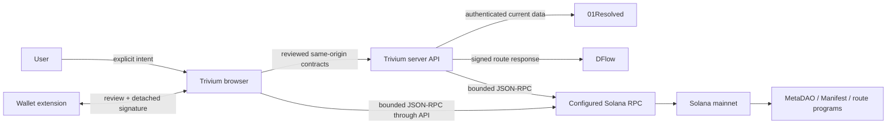

# Trivium Security Control Matrix v1

| Field | Value |
|---|---|
| Recorded | 2026-08-05 |
| Candidate scope | Source-controlled guarded mainnet execution release |
| Boundary inventory | [`security/execution-boundaries.json`](../../security/execution-boundaries.json) |
| Machine gate | [`scripts/security-invariants.mjs`](../../scripts/security-invariants.mjs) |
| Candidate evidence | [`scripts/audit-candidate-evidence.mjs`](../../scripts/audit-candidate-evidence.mjs) |
| Audit status | **NOT AN AUDIT OR INDEPENDENT SECURITY APPROVAL** |

This document tells a reviewer what Trivium intends to enforce, where the
enforcement lives, what is already tested, and what evidence is still missing.
“Enforced” means a repository control and test exist. It does not mean an
independent reviewer has found the control sufficient.

## Trust boundaries

The browser is untrusted, wallet providers are untrusted until returned bytes
are checked, DFlow and RPC responses are untrusted inputs, and all referenced
on-chain programs are third-party deployments. Server secrets terminate at the
Trivium API. No browser code should receive or reconstruct them.

## Funds-sensitive surface inventory

All rows are governed by the shared `EXECUTION_RELEASE` gate. The gate is
enabled for this source release, while each path remains fail-closed on missing
configuration, integrity, account-policy, simulation, expiry, or message-binding
evidence.

| User action | Transaction builder / kind | Final submission boundary |
|---|---|---|
| Review ownership trade | `buildDflowSpotPlan` / `spot` | Detached wallet signature → server `spot-submit` validation → server RPC |
| Execute conditional swap | `buildConditionalSwapPlan` / `conditional-setup`, `swap` | Detached wallet signature → reviewed same-origin RPC relay |
| Redeem resolved position | `buildConditionalRedeemPlan` / `redeem` | Detached wallet signature → reviewed same-origin RPC relay |
| Place limit order | `buildManifestLimitPlan` / `manifest-setup`, `limit` | Detached wallet signature → reviewed same-origin RPC relay |
| Cancel limit order | `buildManifestCancelPlan` / `cancel` | Detached wallet signature → reviewed same-origin RPC relay |
| Withdraw Manifest balance | `buildManifestWithdrawPlan` / `withdraw` | Detached wallet signature → reviewed same-origin RPC relay |
| Create recurring schedule | `buildRecurringSchedulePlan` / `recurring-create` | Paused; also fails if the recurring deployment and keeper are not verified |
| Cancel recurring schedule | `buildRecurringCancelPlan` / `recurring-cancel` | Detached wallet signature → reviewed same-origin RPC relay |
| Claim recurring output | `buildRecurringClaimPlan` / `recurring-claim` | Detached wallet signature → reviewed same-origin RPC relay |

The browser action inventory also includes the final `approve-transaction`
step. CI fails if a builder, transaction kind, final boundary, or execution
action drifts from the machine-readable inventory.

## Control matrix

| ID | Control objective | Repository enforcement and evidence | Status | Remaining work / risk |
|---|---|---|---|---|
| REL-01 | Execution state must remain explicit, code-owned, and globally reversible. | Frozen `EXECUTION_RELEASE`; browser, trading API, and RPC relay consume the same release; disabled-state regression tests remain; invariant checks bind every published representation. | Enabled by source release | Any pause or re-enable requires a reviewed source change and deployment. Independent audit status remains separate from operator authorization. |
| INT-01 | A transaction starts only from explicit user intent. | Eight execution actions are centralized in `EXECUTION_ACTIONS`; review modal and wallet approval are separate boundaries; no automatic signer exists. | Enforced | Independent UX review must verify that action, asset, amount, outcome, destination, fees, and slippage are understandable on every path. |
| WAL-01 | A wallet cannot hide or mutate submitted bytes. | Wallet Standard and legacy adapters require detached `signTransaction`; opaque `signAndSendTransaction` is excluded; returned bytes are decoded and compared. | Enforced | Compatibility is intentionally narrower. Test the exact supported wallet/version matrix before launch. |
| TX-01 | Simulated, reviewed, signed, and submitted messages must be identical. | SHA-256 review fingerprint before/after simulation; fingerprint checked before signing; wallet-returned message and required co-signatures checked before raw send; server repeats the comparison for spot. | Enforced | Independent review must validate legacy and v0 serialization assumptions, address lookup tables, and all co-signer cases. |
| TX-02 | Final state must be fresh enough to execute safely. | 90-second browser review age; DFlow proof age and block-height expiry; minimum context slots; restart cooldown; program integrity rechecked; signed spot transaction simulated with signature verification before send. | Partial | Add adversarial tests for every transaction family covering blockhash expiry, delayed approval, slot rollback, duplicate submission, and restart transitions. |
| TX-03 | Replays must not create a second economic action. | Solana signatures and recent blockhashes make identical resubmission idempotent/expiring; spot review tokens expire. | Partial | The DFlow review token is not server-consumed once. Document and independently test duplicate and concurrent submission behavior. |
| SOL-01 | Only reviewed program deployments may execute. | Program ID, ProgramData address, deployment slot, and upgrade authority pins for MetaDAO, Conditional Vault, Manifest Core/Wrapper, DFlow, and allowed route programs; fail-closed runtime checks. | Enforced | These are upgradeable third-party programs. Re-review and repin only after source/deployment review. A dishonest RPC can still lie about account state. |
| SOL-02 | Accounts and privileges must match the intended action. | Owner, discriminator, PDA, mint pair, signer, writable-account, fee payer, recipient, balance, and instruction/program checks across decision and DFlow policies. | Partial | Build a per-instruction account matrix and have a Solana specialist validate every positive and negative case against cloned mainnet state. |
| SOL-03 | Unsupported token-program behavior must fail closed. | Decision/ownership execution requires classic SPL Token accounts and mints. DFlow permits at most one Token-2022 compatibility program, read-only and non-signer, while traded accounts/mints remain classic SPL. | Enforced | Token-2022 trading is out of scope. Any expansion requires extension-level threat analysis and new audit scope. |
| SOL-04 | Undeployed automation must not appear usable. | Recurring creation checks executable program state; server config requires a program ID and keeper-ready flag independently of the global release. | Paused | No reviewed recurring deployment/keeper evidence exists. Keep creation unavailable until program, keeper, custody, liveness, cancellation, and incident controls are audited. |
| DFL-01 | DFlow responses must be authentic, fresh, and bound to the request. | Server-only API key and allowlisted upstream; Ed25519 response signature, digest, request ID, timestamp, size, status, and URL validation; proof revalidated on submit. | Enforced | Confirm key-rotation and upstream incident procedures with DFlow; retain no secret-bearing evidence. |
| DFL-02 | An authentic route must also be economically authorized. | Transaction decoder constrains signer, owner accounts, mint pair, route venue/program, lookup tables, compute budget, slippage, fees, simulated balance effects, and exact signed message. | Partial | Independent semantic review is required. Current venue allowlist is deliberately narrow and must not be expanded from metadata alone. |
| API-01 | Browser execution must use reviewed same-origin contracts. | Browser imports `@01resolved/api-client`; production controller derives the RPC relay from `client.futarchy.solanaRpcUrl()`; runtime RPC URL override removed; no direct DFlow call. | Enforced | Confirm deployed origin routing and preview/production separation in Vercel. |
| API-02 | Unsupported or degraded data must fail closed. | Reviewed GET/POST contracts, strict query/body keys, bounded bodies, manual redirects, explicit coverage-gap errors, and current NAV server authentication. | Enforced | Production active-market validation currently needs a passing deployment smoke before candidate acceptance. Historic ownership OHLCV/NAV stays unavailable until 01Resolved publishes it. |
| RPC-01 | The public relay must expose only necessary methods and programs. | Twelve-method exact allowlist; batch/body/response/transaction limits; parameter validation; program allowlist; integrity/minimum-slot binding; submission release gate. | Enforced | Have an independent reviewer verify each RPC method is required and cannot be composed into an unintended write or resource-exhaustion path. |
| RPC-02 | A compromised RPC must not silently redefine reviewed state. | Structural owner/data/program checks and final on-chain execution semantics reduce impact. | Partial | One configured RPC remains a trust dependency. Define provider controls, monitoring, failover, and whether quorum or an independently verified state source is needed for high-value execution. |
| SEC-01 | Secrets must remain server-only. | Browser-source scan rejects server credential identifiers, private DFlow upstream URLs, and secret-like `VITE_*` names; same-origin server adapters hold credentials. | Enforced | Export redacted Vercel environment scope and rotation evidence. Repository scanning does not prove deployment configuration or git history is clean. |
| WEB-01 | Browser injection and capability exposure must be constrained. | CSP baseline, `nosniff`, referrer, permissions, and cross-domain policy headers; tests assert the deployed configuration shape. | Partial | Embeds and wallet popups currently prevent blanket frame/COOP controls. Perform focused XSS, embed, dependency, wallet-message, and clickjacking review. |
| ABU-01 | Public execution endpoints must resist basic abuse. | POST/OPTIONS only; JSON/content/query validation; bounded request/response sizes; per-view rate limits; upstream timeouts; redacted server errors. | Partial | Current in-memory rate limiting is instance-local. Add edge/WAF limits, distributed abuse controls, alerting, and load evidence. |
| DAT-01 | Financial data must preserve provenance and meaning. | Current NAV is server-backed by 01Resolved; unsupported historic NAV fails closed; historic and projected data have separate semantics and projection disclosures. | Partial | Reconcile all deployed UI states, stale-data behavior, decimals, token identity, and market-validation failures with 01Resolved contracts. |
| SUP-01 | Dependency changes must be reviewable and reproducible. | Locked install, high-severity audit, npm registry signature verification, dependency review, Dependabot, `npm ls`, and CycloneDX SBOM. | Enforced in CI definition | The lockfile was regenerated with the CI runner's npm 11.16.0; both full and optional-free clean installs pass. Capture the same passing artifacts for the exact clean candidate. Registry/network checks are point-in-time evidence, not permanent safety. |
| SAST-01 | Common code vulnerabilities must be scanned. | Pinned CodeQL workflow with `security-extended` queries on PR, main, and weekly schedule. | Defined | CodeQL must run successfully and become a required check; all Critical/High alerts must be closed or independently shown inapplicable. |
| GOV-01 | AI-authored funds-sensitive changes require independent control. | CODEOWNERS, PR checklist, explicit AI-assisted-change disclosure, and frozen-candidate workflow. | Partial | Add a qualified independent reviewer; require approval, CI, dependency review, CodeQL, conversation resolution, signed/controlled releases, and administrator enforcement in GitHub. |
| EVD-01 | Audit evidence must bind to one immutable candidate. | Manual workflow requires a clean tree after the full gate and records commit/tree, critical-file hashes, build hashes, SBOM hash, runtime, and limitations. | Enforced in CI definition | Run it on the eventual audit commit and retain the artifact plus deployment ID/configuration evidence. A dirty local report is not a candidate. |
| OPS-01 | Production controls and response must be demonstrable. | GET-only deployment smoke records contracts, provenance, failure behavior, expected execution release state, and browser headers without building or submitting a transaction. | External evidence needed | Evidence Vercel domains, WAF, logs, alerts, secret scope, deployment access, rollback, emergency pause, incident owner, and tested recovery. |
| TST-01 | Security failures must have regression tests. | Unit/integration tests cover pause gates, malformed inputs, program changes, DFlow signatures and semantics, wallet mutation, simulation mutation, expiry, and RPC restrictions. | Partial | Produce a transaction-family coverage matrix; close missing replay, stale-state, concurrency, wallet-version, and upstream-failure combinations. |
| TST-02 | Execution must be tested against realistic Solana state. | Existing tests use deterministic fixtures and mocked RPC boundaries. | Gap | Add Surfpool or equivalent cloned-mainnet tests for all externally deployed programs and representative accounts. There is no owned on-chain program source in this repository to audit as a local program. |
| AUD-01 | Independent audit approval must come from qualified humans independent of authorship. | The readiness record explicitly prohibits AI self-approval and binds audit scope to an exact commit. | Outstanding | Product-owner execution authorization is not an independent audit. Select an independent Solana/application security firm, remediate findings, and obtain retest evidence before making an audit claim. |

## Priority threat scenarios

1. A compromised browser dependency or wallet changes the recipient, amount,
   mint, program, or account privileges after review.
2. A validly signed DFlow response contains a semantically unsafe route.
3. A malicious or degraded RPC fabricates stale program/account state or a
   submission result.
4. A reviewed third-party program is upgraded between quote, simulation,
   approval, and submission.
5. A stale or replayed review causes an unintended second action.
6. A server secret reaches browser assets, logs, errors, preview deployments, or
   an audit packet.
7. A route, query, batch, lookup table, or simulation response bypasses size,
   account, signer, writable, or program constraints.
8. An AI-authored change expands a builder, RPC method, venue, token, or release
   flag without independent review.

The invariant gate is a drift detector for these boundaries. It is intentionally
not described as semantic proof: an attacker can preserve a checked string while
changing surrounding behavior. Tests, human review, realistic integration
testing, deployment evidence, and independent assessment remain mandatory.

## Evidence packet handoff

For a clean candidate, retain together:

- the **Frozen audit candidate** workflow URL and artifact;
- the commit and tree hashes from `01rx-audit-candidate.json`;
- the CycloneDX SBOM and production `dist` directory whose hashes appear in that
  record;
- the CodeQL, dependency review, CI, and read-only deployment-smoke results;
- redacted GitHub and Vercel control-plane exports;
- the final threat model, transaction/account matrices, test coverage matrix,
  findings log, remediation commits, and independent retest report; and
- a signed human decision stating the exact allowed launch scope, caps,
  monitoring, pause owner, and rollback plan.

Never include private keys, seed phrases, API keys, bearer tokens, full
environment exports, wallet signing material, or private customer data.
